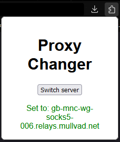
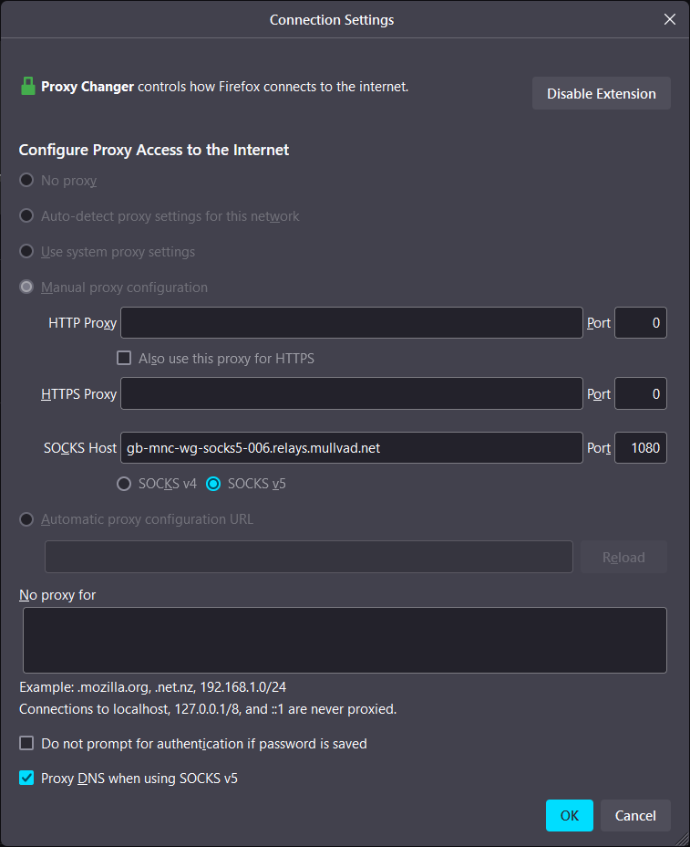

# SOCKS5 Proxy Changer

Make sure to **allow the extension to run in private windows**, it will not work otherwise.

All this does is rotate through a pre-defined list of UK Mullvad servers hosting a SOCKS5 proxy, a few times I have seen sites like Reddit blocking access because of VPN usage, but changing the proxy server has always worked to bypass this.

## Improvements to be made

- Make it work with more locations - I have no use for this currently, but happy to accept PR's.
- Add a button to exclude the currently open site from being proxied - This would be helpful but it's rare enough where it's not a pain to add the exclusion manually.

## Images

